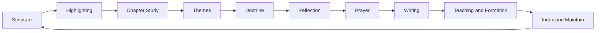
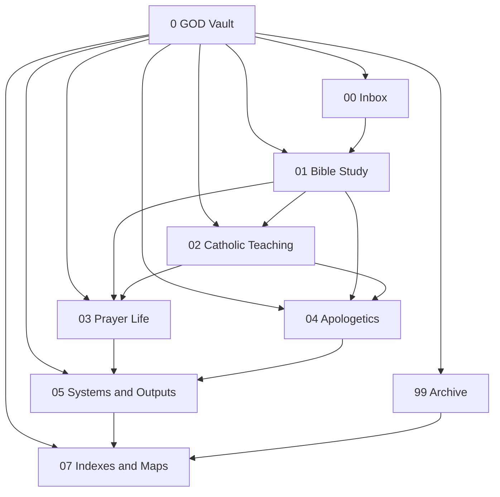
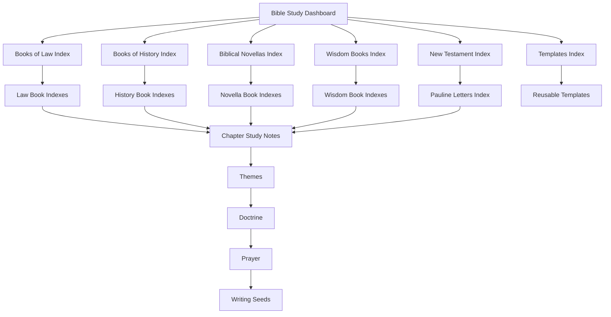
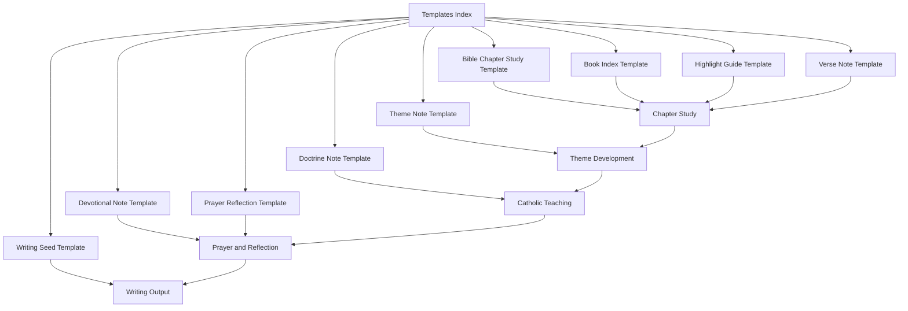
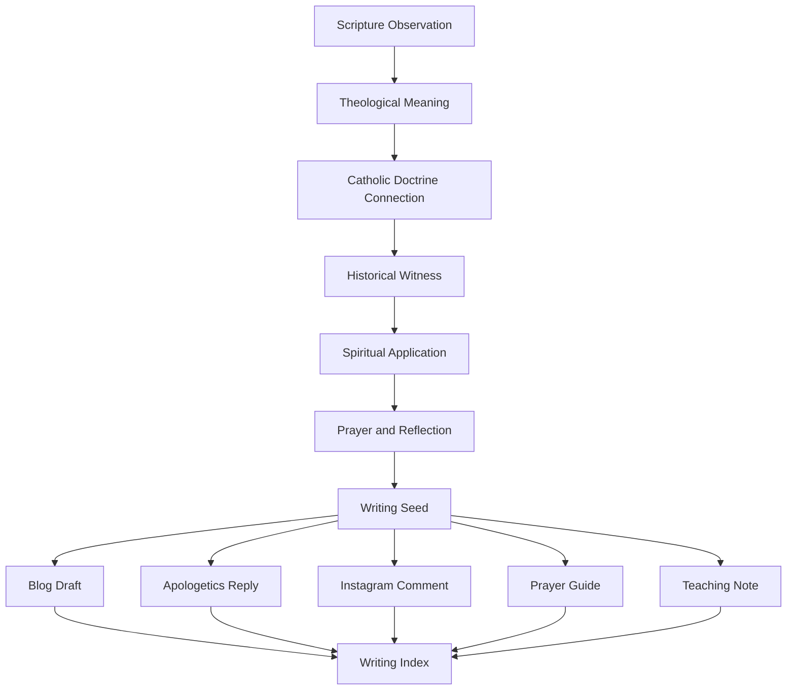

# Obsidian Bible Study Cleanup

> A sacred knowledge system for organizing Bible study, Catholic theology, prayer formation, apologetics, and theological writing inside Obsidian.


---

## Overview

**Obsidian Bible Study Cleanup** is a long-term vault organization project focused on transforming a scattered Bible study folder into a structured, reusable, and spiritually fruitful Catholic study system.

The project centers on the sacred workspace:

```text
~/Documents/My_Daily_Vault/Active/0 GOD
```

The goal is not only to clean files.

The goal is to build a repeatable **Sacred Study Pipeline**:

```text
Scripture → Highlighting → Chapter Study → Themes → Doctrine → Reflection → Prayer → Writing → Teaching and Formation
```

This system is designed for:

- Catholic Bible study
- NABRE highlight tracking
- Chapter-by-chapter Scripture notes
- Theological reflection
- Prayer formation
- Apologetics writing
- Blog and social post development
- Long-term spiritual growth

---

## Table of Contents

- [Overview](#overview)
- [Current Status](#current-status)
- [Current Vault Structure](#current-vault-structure)
- [Sacred Study Pipeline](#sacred-study-pipeline)
- [Vault Architecture Flow](#vault-architecture-flow)
- [Bible Study Section Map](#bible-study-section-map)
- [Index System Flow](#index-system-flow)
- [Template Workflow](#template-workflow)
- [Writing System Flow](#writing-system-flow)
- [Current Navigation Notes](#current-navigation-notes)
- [Current Index Coverage](#current-index-coverage)
- [Template Foundation](#template-foundation)
- [Active Naming Convention](#active-naming-convention)
- [Highlighting System](#highlighting-system)
- [Note Types](#note-types)
- [Completed Project Phases](#completed-project-phases)
- [Next Phase](#next-phase)
- [Known Gaps](#known-gaps)
- [Preservation Rules](#preservation-rules)
- [Archive Areas](#archive-areas)
- [Maintenance Rhythm](#maintenance-rhythm)
- [Recommended Obsidian Setup](#recommended-obsidian-setup)
- [Suggested Tags](#suggested-tags)
- [Cathedral Model](#cathedral-model)

---

## Current Status

The project has moved beyond early cleanup and naming.

The major Books of Law and Books of History have been standardized. Book indexes, section indexes, the Bible Study Dashboard, reusable templates, Wisdom Books indexes, and New Testament indexes now exist.

### Current Project State

```text
Phase 2T — Wisdom Books and New Testament Indexes is complete.
```

### Current Documentation Task

```text
Phase 2U — README Flowchart Sync
```

### Next Project Phase

```text
Phase 2V — Dashboard and PROJECT_CONTEXT Flowchart Sync
```

---

## Current Vault Structure

```text
0 GOD/
├── 00 Inbox/
├── 01 Bible Study/
│   ├── Bible Study Resources/
│   ├── Biblical Novellas/
│   ├── Books of Law/
│   ├── Books of History/
│   ├── New Testament/
│   └── Wisdom Books/
├── 02 Catholic Teaching/
├── 03 Prayer Life/
├── 04 Apologetics/
├── 05 Systems & Outputs/
├── 07 Indexes & Maps/
├── 99 Archive/
└── README.md
```

---

## Sacred Study Pipeline



---

## Vault Architecture Flow



---

## Bible Study Section Map

```mermaid
flowchart TD
  bible_study["01 Bible Study"] --> law["Books of Law"]
  bible_study --> history["Books of History"]
  bible_study --> novellas["Biblical Novellas"]
  bible_study --> wisdom["Wisdom Books"]
  bible_study --> new_testament["New Testament"]
  bible_study --> resources["Bible Study Resources"]

  law --> genesis["Genesis"]
  law --> exodus["Exodus"]
  law --> leviticus["Leviticus"]
  law --> numbers["Numbers"]
  law --> deuteronomy["Deuteronomy"]

  history --> joshua["Joshua"]
  history --> judges["Judges"]
  history --> ruth["Ruth"]
  history --> samuel["Samuel"]
  history --> kings["Kings"]
  history --> chronicles["Chronicles"]
  history --> ezra["Ezra"]

  novellas --> tobit["Tobit"]
  novellas --> judith["Judith"]
  novellas --> esther["Esther"]
  novellas --> nehemiah["Nehemiah"]
  novellas --> maccabees["Maccabees"]

  wisdom --> job["Job"]
  wisdom --> psalms["Psalms"]
  wisdom --> proverbs["Proverbs"]

  new_testament --> pauline_letters["Pauline Letters"]
```



---

## Index System Flow



---

## Template Workflow



---

## Writing System Flow



---

## Current Navigation Notes

Primary dashboard:

- `07 Indexes & Maps/Bible Study Dashboard.md`

Main section indexes:

- `01 Bible Study/Books of Law/Books of Law Index.md`
- `01 Bible Study/Books of History/Books of History Index.md`
- `01 Bible Study/Biblical Novellas/Biblical Novellas Index.md`
- `01 Bible Study/Wisdom Books/Wisdom Books Index.md`
- `01 Bible Study/New Testament/New Testament Index.md`

Project maps:

- `07 Indexes & Maps/PROJECT_CONTEXT.md`
- `07 Indexes & Maps/Sacred Study System - Visual Node Map.md`
- `07 Indexes & Maps/Bible Timeline.md`

Template map:

- `05 Systems & Outputs/Templates/Templates Index.md`

---

## Current Index Coverage

### Books of Law

- Genesis Index
- Exodus Index
- Leviticus Index
- Numbers Index
- Deuteronomy Index
- Books of Law Index

### Books of History

- Joshua Index
- Judges Index
- Ruth Index
- 1 Samuel Index
- 2 Samuel Index
- 1 Kings Index
- 2 Kings Index
- 1 Chronicles Index
- 2 Chronicles Index
- Ezra Index
- Books of History Index

### Biblical Novellas

- Tobit Index
- Judith Index
- Esther Index
- Nehemiah Index
- Maccabees Index
- Biblical Novellas Index

### Wisdom Books

- Job Index
- Psalms Index
- Proverbs Index
- Wisdom Books Index

### New Testament

- New Testament Index
- Pauline Letters Index

---

## Template Foundation

Templates live in:

```text
05 Systems & Outputs/Templates/
```

Current templates:

- Bible Chapter Study Template.md
- Book Index Template.md
- Devotional Note Template.md
- Doctrine Note Template.md
- Highlight Guide Template.md
- Prayer Reflection Template.md
- Theme Note Template.md
- Verse Note Template.md
- Writing Seed Template.md
- Templates Index.md

---

## Active Naming Convention

The active chapter-note naming pattern is:

```text
Book 00 - Chapter Study.md
```

Examples:

- Genesis 01 - Chapter Study.md
- Exodus 01 - Chapter Study.md
- Numbers 05 - Chapter Study.md
- Joshua 19 - Chapter Study.md
- 1 Samuel 31 - Chapter Study.md
- 2 Samuel 24 - Chapter Study.md
- 1 Kings 22 - Chapter Study.md
- 2 Kings 25 - Chapter Study.md
- 1 Chronicles 29 - Chapter Study.md

Other note examples:

- Genesis Overview.md
- Ruth Introduction.md
- 2 Samuel Highlights.md
- Exodus Highlight Guide.md
- 1 Kings 03 - Devotional.md
- Genesis 02-18 - Verse Note.md
- Exodus 13-02 and 13-13 - Verse Note.md
- Kings - Top Chapters.md
- Samuel Books Overview.md
- Psalms Prayer Map.md
- Romans 11 - Study Note.md

### Naming Rules

- Use two-digit chapter numbers.
- Keep note type at the end.
- Avoid vague titles like Notes, Highlights, or Chapter unless the book name makes it specific.
- Use consistent capitalization.
- Archive older duplicates before deleting.
- Prefer clarity over cleverness.
- Do not invent missing chapter notes during cleanup.

---

## Highlighting System

The project uses a four-color Bible highlighting system.

| Color | Meaning |
|---|---|
| Gold | God, covenant, promise, worship, divine action |
| Blue | Doctrine, theology, prophecy, Christological meaning |
| Green | Virtue, wisdom, obedience, spiritual growth |
| Red | Sin, judgment, warning, suffering, conflict |

---

## Note Types

| Note Type | Purpose |
|---|---|
| Chapter Study | Main chapter summary, plot, theology, and outcome |
| Highlight Guide | Color-coded marking guide for the physical Bible |
| Book Overview | Big-picture book purpose, context, authorship, and structure |
| Introduction | Book or section introduction notes |
| Devotional | Prayerful application tied to a chapter or theme |
| Verse Note | Focused reflection on a specific verse or verse cluster |
| Theme Note | Tracks ideas like covenant, sacrifice, wisdom, sin, and grace |
| Doctrine Note | Connects Scripture to Catholic teaching |
| Prayer Reflection | Turns study into prayer and devotion |
| Writing Seed | Turns study into future blog, comment, teaching, or apologetics output |
| Index Note | Helps navigate related notes |
| Template Note | Provides repeatable structure for future study |

---

## Completed Project Phases

| Phase | Name | Status |
|---|---|---|
| 0 | Project Orientation | Complete |
| 1 | Vault Inventory | Complete |
| 2A | Misplaced System Folder Cleanup | Complete |
| 2B | Generic Highlight Renaming | Complete |
| 2C | Extra Highlight Review | Complete |
| 2D | Misplaced and Unclear Bible Notes | Complete |
| 2E | Overview and Introduction Standardization | Complete |
| 2F | First Chapter Naming Batch | Complete |
| 2G | Law Chapter Naming Batch | Complete |
| 2H | 1 Samuel Chapter Naming | Complete |
| 2I | 2 Samuel Chapter Naming | Complete |
| 2J | Kings Chapter Naming | Complete |
| 2K | Chronicles Notes | Complete |
| 2L | Devotional, Verse, and Special Notes | Complete |
| 2M | Book Index Notes | Complete |
| 2N | Section Indexes and Bible Study Dashboard | Complete |
| 2O | Biblical Novellas and Remaining History Indexes | Complete |
| 2P | Documentation Sync | Complete |
| 2Q | Template Foundation | Complete |
| 2R | Template Integration and Workflow Wiring | Complete |
| 2S | Root-Level Bible Study Classification | Complete |
| 2T | Wisdom Books and New Testament Indexes | Complete |
| 2U | README Flowchart Sync | Current |

---

## Next Phase

## Phase 2V — Dashboard and PROJECT_CONTEXT Flowchart Sync

The next phase should update the two core navigation notes with the same visual flow logic now added to this README:

- `07 Indexes & Maps/Bible Study Dashboard.md`
- `07 Indexes & Maps/PROJECT_CONTEXT.md`

Recommended tasks:

- Add a compact Sacred Study Pipeline flowchart to the dashboard.
- Add a Bible section map to the dashboard.
- Add a template workflow section.
- Add a maintenance flow section.
- Update PROJECT_CONTEXT so it matches the README state.

---

## Known Gaps

These are not problems. They are simply known gaps in the current vault.

- `1 Samuel 06 - Chapter Study.md` does not currently exist.
- `1 Chronicles 16` through `1 Chronicles 20` do not currently exist.
- `2 Chronicles` currently has a highlights note and index, but no chapter study notes in the current snapshot.
- `00 Inbox` still contains raw notes that need future review.
- Templates exist and are indexed, but dashboard and project context can still be improved with stronger workflow instructions.

---

## Preservation Rules

- Do not delete aggressively.
- Rename first.
- Archive before removing.
- Preserve uncertain notes in review folders.
- Do not invent missing chapter notes.
- Move slowly by phase.
- Re-export file and folder snapshots after each major phase.
- Prefer `mv -n` when renaming.
- Prefer `mkdir -p` when creating folders.

---

## Archive Areas

Current archive review folders include:

- `99 Archive/Needs Review/Bible Book Notes`
- `99 Archive/Needs Review/Chapter Naming`
- `99 Archive/Needs Review/Generated Content`
- `99 Archive/Needs Review/Possible Duplicates`
- `99 Archive/Old Highlight Notes`
- `99 Archive/Unsorted Legacy Notes`

---

## Maintenance Rhythm

### Weekly Maintenance

- Review inbox notes.
- Rename messy files.
- Move notes to the right folders.
- Update Bible book indexes.
- Archive duplicates.
- Review backlinks.
- Choose one note to polish.

### Monthly Maintenance

- Review folder structure.
- Check for duplicate themes.
- Update templates.
- Refine indexes.
- Merge overlapping notes.
- Choose one theological writing piece to develop.

---

## Recommended Obsidian Setup

Useful Obsidian features and plugins for this project:

| Tool | Use |
|---|---|
| Backlinks | Connect chapter, theme, doctrine, and prayer notes |
| Graph View | Visualize relationships between Scripture and theology |
| Templates | Create reusable note structures |
| Templater | Add advanced template automation |
| Dataview | Create dynamic indexes and dashboards |
| QuickAdd | Capture notes quickly into the right format |
| Tags | Mark status, note type, themes, and writing stage |
| Search | Locate duplicates, themes, and references |

---

## Suggested Tags

- `#bible-study`
- `#chapter-study`
- `#highlight-guide`
- `#book-overview`
- `#introduction`
- `#devotional`
- `#verse-note`
- `#theme-note`
- `#doctrine-note`
- `#prayer-reflection`
- `#writing-seed`
- `#blog-draft`
- `#needs-review`
- `#archive-candidate`

---

## Suggested Status Labels

- `status/raw`
- `status/review`
- `status/master`
- `status/archived`
- `status/template`
- `status/polished`
- `status/published`

---

## Cathedral Model

This project should feel like a cathedral-library:

```text
Inbox = the open courtyard
Bible Study = the nave
Highlights = the stained glass
Catholic Teaching = the columns
Prayer Life = the altar
Apologetics = the defense wall
Systems and Outputs = the workshop
Indexes and Maps = the front door
Templates = the tools of the craftsman
Archive = the preserved stonework
```

The finished system should not only hold notes.

It should guide study, doctrine, prayer, writing, and spiritual formation.

---

## License

This project is a personal knowledge management and study system.

Use, adapt, and refine the structure for your own Obsidian vault as needed.
