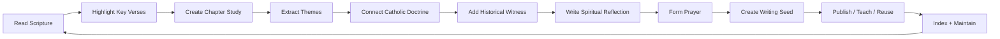
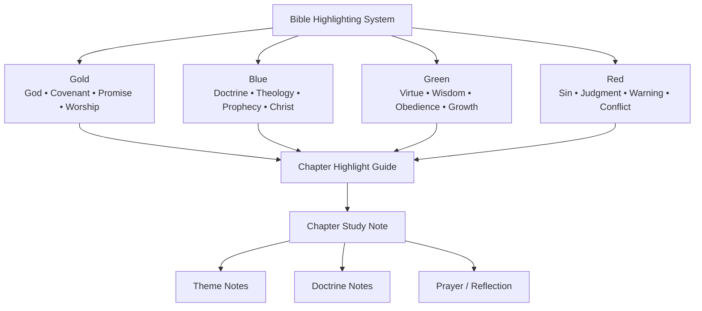
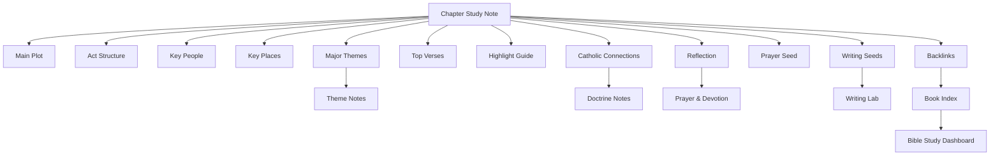

# Obsidian Bible Study Cleanup

> A sacred knowledge system for organizing Bible study, Catholic theology, prayer formation, and theological writing inside Obsidian.


---

## Overview

**Obsidian Bible Study Cleanup** is a long-term vault organization project focused on transforming a scattered Bible study folder into a structured, reusable, and spiritually fruitful study system.

The project centers on the sacred workspace:

```text
~/Documents/My_Daily_Vault/Active/0 GOD
```

The goal is not only to clean files.

The goal is to build a repeatable **Sacred Study Pipeline** that moves from:

```text
Scripture → Highlighting → Chapter Study → Themes → Doctrine → Reflection → Prayer → Writing → Teaching / Formation
```

This system is designed for:

* Catholic Bible study
* NABRE highlight tracking
* Chapter-by-chapter Scripture notes
* Theological reflection
* Prayer formation
* Apologetics writing
* Blog and social post development
* Long-term spiritual growth

---

## Table of Contents

* [Overview](#overview)
* [Project Philosophy](#project-philosophy)
* [Current Status](#current-status)
* [Core Goals](#core-goals)
* [Sacred Study Pipeline](#sacred-study-pipeline)
* [Final Folder Architecture](#final-folder-architecture)
* [Note Types](#note-types)
* [Naming Convention](#naming-convention)
* [Highlighting System](#highlighting-system)
* [Project Roadmap](#project-roadmap)
* [Current Active Phase](#current-active-phase)
* [Definition of Complete](#definition-of-complete)
* [Maintenance Rhythm](#maintenance-rhythm)
* [Recommended Obsidian Setup](#recommended-obsidian-setup)
* [Cathedral Model](#cathedral-model)

---

## Project Philosophy

This project follows a careful, preservation-first cleanup model.

### Guiding Rules

* Do not delete aggressively.
* First classify, rename, archive, and standardize.
* Preserve older notes until duplicates are confirmed.
* Build structure before automation.
* Build templates only after naming and folder systems are stable.
* Move slowly, phase by phase.
* Treat the vault as a sacred study environment, not just a file system.

---

## Current Status

The project has already passed the first discovery stage.

### Completed / Started

* Vault inventory exported.
* Current folders reviewed.
* Current files reviewed.
* Initial cleanup audit created.
* First cleanup pass completed.
* Updated file/folder snapshots reviewed.
* Refined final node map created.

### Current Working Phase

```text
Phase 2B — Naming & Duplicate Standardization
```

Before building dashboards, templates, or automation, the vault needs clean file identities.

---

## Core Goals

This project aims to create a system that can:

1. Organize Bible notes by book, chapter, theme, and study type.
2. Separate raw notes from polished notes.
3. Standardize chapter note names.
4. Preserve legacy notes through safe archiving.
5. Connect Scripture notes through backlinks and indexes.
6. Support Catholic doctrine, Church Fathers, and apologetics notes.
7. Turn Bible study into reflection, prayer, and writing.
8. Create reusable Obsidian templates.
9. Build dashboards and Maps of Content.
10. Maintain the system through weekly and monthly review.

---

## Sacred Study Pipeline

The finished workflow should move like this:



### Daily Study Flow

```text
Read chapter
↓
Highlight verses
↓
Create or update chapter note
↓
Extract themes
↓
Connect doctrine
↓
Write reflection
↓
Form prayer
↓
Create writing seed
↓
Link to indexes
```

---

## Final Folder Architecture

```text
0 GOD/
├── 00 Inbox/
│   └── Raw captures, quick notes, unprocessed imports
│
├── 01 Bible Study/
│   ├── Old Testament/
│   ├── New Testament/
│   ├── Deuterocanonical Books/
│   └── Bible Book Indexes/
│
├── 02 Highlights/
│   ├── Gold - God & Covenant/
│   ├── Blue - Doctrine & Theology/
│   ├── Green - Virtue & Practice/
│   └── Red - Sin, Warning & Judgment/
│
├── 03 Theology/
│   ├── Catholic Doctrine/
│   ├── Church Fathers/
│   ├── Apologetics/
│   └── Theological Arguments/
│
├── 04 Prayer & Devotion/
│   ├── Prayer Structures/
│   ├── Written Prayers/
│   └── Lectio Divina/
│
├── 05 Writing Lab/
│   ├── Blog Drafts/
│   ├── Reflections/
│   ├── Instagram Comments/
│   └── Teaching Notes/
│
├── 06 Templates/
│   ├── Bible Chapter Study Template.md
│   ├── Highlight Guide Template.md
│   ├── Theme Note Template.md
│   ├── Doctrine Note Template.md
│   ├── Prayer Formation Template.md
│   └── Blog Reflection Template.md
│
├── 07 Indexes & Maps/
│   ├── Bible Study Dashboard.md
│   ├── Old Testament Index.md
│   ├── New Testament Index.md
│   ├── Deuterocanonical Books Index.md
│   ├── Highlight System Index.md
│   ├── Catholic Doctrine Index.md
│   ├── Prayer Index.md
│   └── Theological Writing Index.md
│
└── 99 Archive/
    ├── Duplicate Bible Notes/
    ├── Old Highlight Notes/
    ├── Unsorted Legacy Notes/
    └── Deprecated Drafts/
```

---

## Note Types

| Note Type          | Purpose                                                       |
| ------------------ | ------------------------------------------------------------- |
| Chapter Study      | Main chapter summary, plot, theology, and outcome             |
| Highlight Guide    | Color-coded marking guide for the physical Bible              |
| Character Note     | Tracks biblical figures and theological patterns              |
| Theme Note         | Tracks ideas like covenant, sacrifice, wisdom, sin, and grace |
| Doctrine Note      | Connects Scripture to Catholic teaching                       |
| Church Father Note | Preserves historical Christian witness                        |
| Prayer Note        | Turns study into prayer and devotion                          |
| Reflection Note    | Develops spiritual insight from study                         |
| Blog Draft         | Turns theology into publishable writing                       |
| Index Note         | Helps navigate related notes                                  |
| Template Note      | Provides repeatable structure for future study                |

---

## Naming Convention

The standard file naming pattern is:

```text
Book 00 - Note Type.md
```

### Examples

```text
Genesis 17 - Chapter Study.md
Genesis 17 - Highlight Guide.md
Exodus 09 - Chapter Study.md
Job 02 - Chapter Study.md
Job 02 - Highlight Guide.md
Psalms - Category Index.md
Catholic Doctrine Index.md
Prayer Formation Template.md
```

### Naming Rules

* Use two-digit chapter numbers.
* Keep note type at the end.
* Avoid vague titles like `Notes`, `Highlights`, or `Chapter`.
* Use consistent capitalization.
* Archive older duplicates before deleting.
* Prefer clarity over cleverness.

---

## Highlighting System

The project uses a four-color Bible highlighting system.

| Color | Meaning                                              |
| ----- | ---------------------------------------------------- |
| Gold  | God, covenant, promise, worship, divine action       |
| Blue  | Doctrine, theology, prophecy, Christological meaning |
| Green | Virtue, wisdom, obedience, spiritual growth          |
| Red   | Sin, judgment, warning, suffering, conflict          |

### Highlight Flow



---

## Chapter Study Template

Every complete chapter note should eventually include:

1. Chapter Title
2. Main Plot
3. Act Structure
4. Key People
5. Key Places
6. Major Theological Themes
7. Catholic Connections
8. Top Verses
9. Highlight Color Guide
10. Spiritual Reflection
11. Prayer Connection
12. Backlinks
13. Writing Seeds

### Chapter Note Flow



---

## Project Roadmap

| Phase | Name                               |   Status | Purpose                                             |
| ----- | ---------------------------------- | -------: | --------------------------------------------------- |
| 0     | Project Orientation                | Complete | Define the purpose and sacred direction             |
| 1     | Vault Inventory                    | Complete | Export and review current files/folders             |
| 2     | Initial Cleanup Audit              |  Started | Identify duplicates, loose notes, and unclear files |
| 2A    | First Cleanup Pass                 | Complete | Confirm early organization progress                 |
| 2B    | Naming & Duplicate Standardization |   Active | Stabilize file names and archive duplicates         |
| 3     | Folder Architecture                | Upcoming | Build the long-term folder system                   |
| 4     | Bible Note Types                   | Upcoming | Define the purpose of each note type                |
| 5     | Standard Chapter Template          | Upcoming | Create repeatable chapter study structure           |
| 6     | Highlighting System Integration    |  Planned | Connect Obsidian notes to Bible highlights          |
| 7     | Sacred Study Pipeline              |  Planned | Build the repeatable study workflow                 |
| 8     | Indexes & Maps                     |  Planned | Create dashboards and Maps of Content               |
| 9     | Templates & Automation             |    Later | Use Obsidian tools to speed up repeatable work      |
| 10    | Theological Writing System         |    Later | Turn study into blogs, prayers, and teaching        |
| 11    | Maintenance Rhythm                 |    Final | Keep the system clean over time                     |

---

## Current Active Phase

## Phase 2B — Naming & Duplicate Standardization

This is the next practical cleanup layer.

### Tasks

* [ ] Identify duplicate Bible chapter notes.
* [ ] Decide which note becomes the master version.
* [ ] Rename chapter notes consistently.
* [ ] Move old versions into `99 Archive`.
* [ ] Separate highlight notes from chapter summaries.
* [ ] Keep uncertain files in `00 Inbox`.
* [ ] Avoid deleting unless fully confirmed.
* [ ] Re-export file and folder structure after changes.

### Phase 2B Output

A cleaner Bible study library with predictable names and safe archives.

---

## Definition of Complete

This project is complete when:

* [ ] Every Bible chapter note has a predictable name.
* [ ] Highlight notes are separated from chapter summaries.
* [ ] Duplicates are archived, not scattered.
* [ ] Bible books have index pages.
* [ ] Themes and doctrine notes are linked.
* [ ] Prayer and writing outputs have their own folders.
* [ ] Templates exist for repeatable work.
* [ ] The dashboard becomes the main entry point.
* [ ] Weekly maintenance keeps the system clean.

---

## Maintenance Rhythm

### Weekly Maintenance

* Review inbox notes.
* Rename messy files.
* Move notes to the right folders.
* Update Bible book indexes.
* Archive duplicates.
* Review backlinks.
* Choose one note to polish.

### Monthly Maintenance

* Review folder structure.
* Check for duplicate themes.
* Update templates.
* Refine indexes.
* Merge overlapping notes.
* Choose one theological writing piece to develop.

---

## Recommended Obsidian Setup

Useful Obsidian features and plugins for this project:

| Tool       | Use                                                    |
| ---------- | ------------------------------------------------------ |
| Backlinks  | Connect chapter, theme, doctrine, and prayer notes     |
| Graph View | Visualize relationships between Scripture and theology |
| Templates  | Create reusable note structures                        |
| Templater  | Add advanced template automation                       |
| Dataview   | Create dynamic indexes and dashboards                  |
| QuickAdd   | Capture notes quickly into the right format            |
| Tags       | Mark status, note type, themes, and writing stage      |
| Search     | Locate duplicates, themes, and references              |

---

## Suggested Tags

```text
#bible-study
#chapter-study
#highlight-guide
#theme-note
#doctrine-note
#church-fathers
#prayer
#reflection
#writing-seed
#blog-draft
#needs-review
#archive-candidate
```

---

## Suggested Status Labels

```text
status/raw
status/review
status/master
status/archived
status/template
status/polished
status/published
```

---

## Cathedral Model

This project should feel like a cathedral-library:

```text
Inbox      = the open courtyard
Bible Study = the nave
Highlights = the stained glass
Theology   = the columns
Prayer     = the altar
Writing Lab = the pulpit
Indexes    = the map of the cathedral
Templates  = the tools of the craftsman
Archive    = the preserved stonework
Dashboard  = the front door
```

The finished system should not only hold notes.

It should guide study, prayer, doctrine, writing, and spiritual formation.

---

## License

This project is a personal knowledge management and study system.

Use, adapt, and refine the structure for your own Obsidian vault as needed.

---

## Next Step

Continue with:

```text
Phase 2B — Naming & Duplicate Standardization
```

Recommended next action:

```text
Review latest file and folder exports → identify duplicates → choose master notes → rename safely → archive old versions → re-export structure.
```
