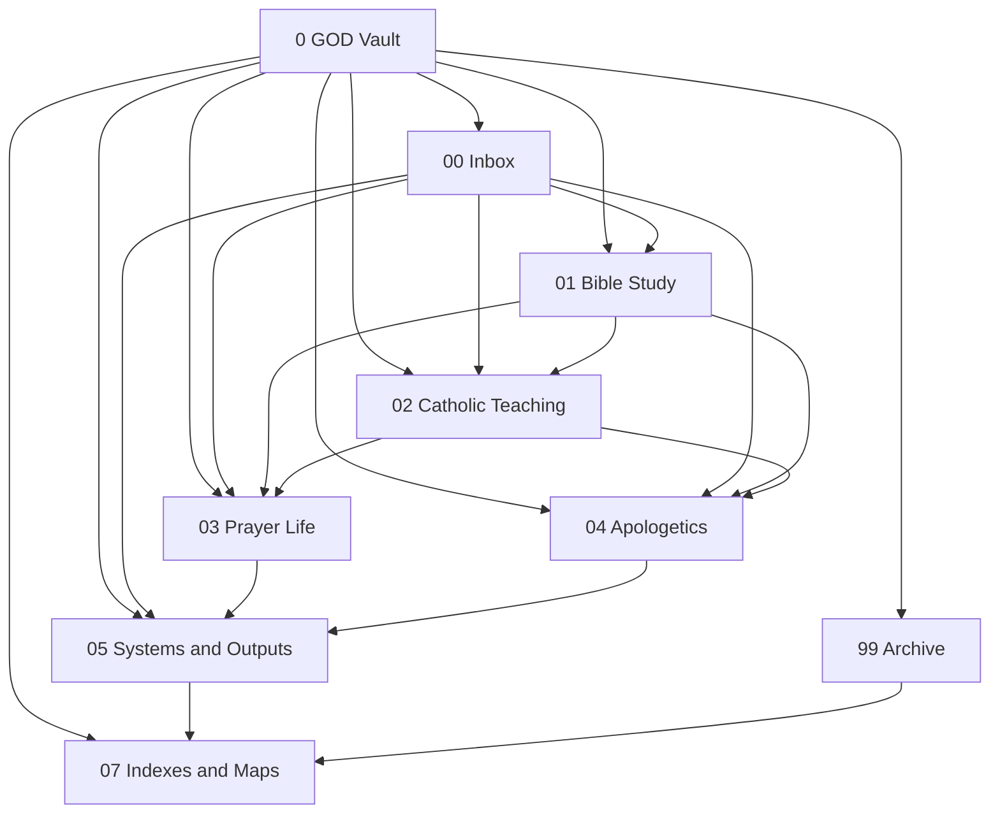
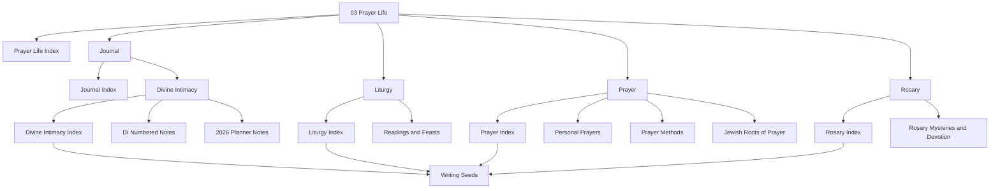
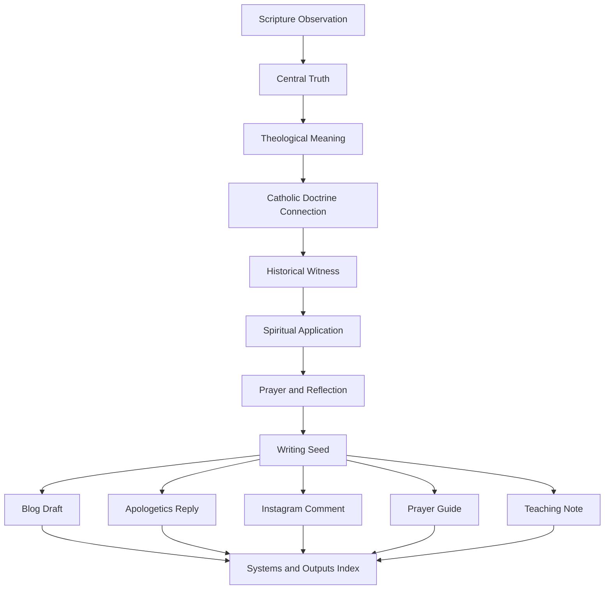
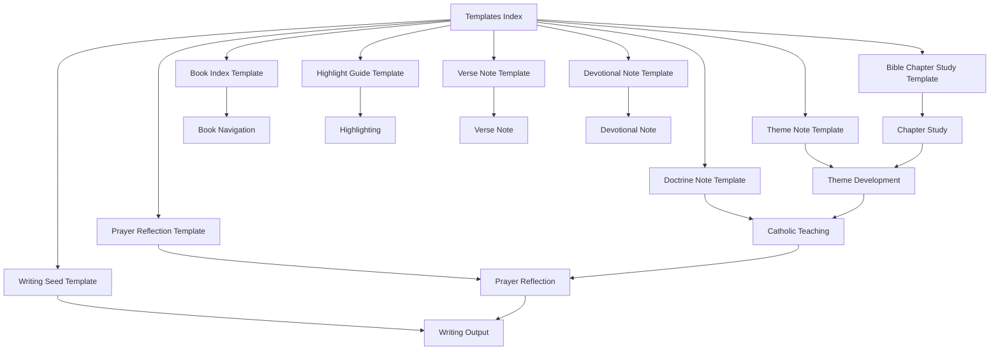

# Obsidian Bible Study Cleanup

> A sacred knowledge system for organizing Bible study, Catholic theology, prayer formation, apologetics, devotional life, and theological writing inside Obsidian.


---

## Overview

**Obsidian Bible Study Cleanup** is a long-term vault organization project focused on transforming a scattered Bible study folder into a structured, reusable, and spiritually fruitful Catholic study system.

The project centers on the sacred workspace:

```text
~/Documents/My_Daily_Vault/Active/0 GOD
```

The goal is not only to clean files.

The goal is to build a repeatable **Sacred Study Pipeline**:

```text
Scripture → Highlighting → Chapter Study → Themes → Doctrine → Reflection → Prayer → Writing → Teaching and Formation
```

This system is designed for:

- Catholic Bible study
- NABRE highlight tracking
- Chapter-by-chapter Scripture notes
- Theological reflection
- Prayer formation
- Divine Intimacy journaling
- Liturgy and feast-day study
- Catholic doctrine notes
- Apologetics writing
- Blog and social post development
- Long-term spiritual growth

---

## Table of Contents

- [Overview](#overview)
- [Current Status](#current-status)
- [Current Vault Structure](#current-vault-structure)
- [Sacred Study Pipeline](#sacred-study-pipeline)
- [Vault Architecture Flow](#vault-architecture-flow)
- [Bible Study Section Map](#bible-study-section-map)
- [Prayer Life Flow](#prayer-life-flow)
- [Writing System Flow](#writing-system-flow)
- [Index System Flow](#index-system-flow)
- [Template Workflow](#template-workflow)
- [Current Navigation Notes](#current-navigation-notes)
- [Current Index Coverage](#current-index-coverage)
- [Current Cleanup Audits](#current-cleanup-audits)
- [Template Foundation](#template-foundation)
- [Active Naming Conventions](#active-naming-conventions)
- [Highlighting System](#highlighting-system)
- [Note Types](#note-types)
- [Completed Project Phases](#completed-project-phases)
- [Next Phase](#next-phase)
- [Known Gaps](#known-gaps)
- [Preservation Rules](#preservation-rules)
- [Archive Areas](#archive-areas)
- [Maintenance Rhythm](#maintenance-rhythm)
- [Recommended Obsidian Setup](#recommended-obsidian-setup)
- [Suggested Tags](#suggested-tags)
- [Suggested Status Labels](#suggested-status-labels)
- [Cathedral Model](#cathedral-model)

---

## Current Status

The project has moved beyond the early Bible folder cleanup and into system-wide navigation, indexes, prayer organization, audit workflows, and naming cleanup.

The major Books of Law and Books of History have been standardized. Book indexes, section indexes, the Bible Study Dashboard, reusable templates, Wisdom Books indexes, New Testament indexes, Prayer Life indexes, Catholic Teaching indexes, Apologetics indexes, and Systems & Outputs indexes now exist.

The Inbox has been drained and classified into the working vault structure.

Divine Intimacy notes have been renamed into cleaner patterns, and Prayer notes have been cleaned from underscore-heavy filenames into readable Obsidian titles.

### Current Project State

```text
Phase 3E — Prayer Note Name Cleanup is complete.
```

### Current Cleanup Layer

```text
Prayer Life cleanup is active.
```

### Next Project Phase

```text
Phase 3F — Liturgy Note Name Cleanup
```

---

## Current Vault Structure

```text
0 GOD/
├── 00 Inbox/
├── 01 Bible Study/
│   ├── Bible Study Resources/
│   ├── Biblical Novellas/
│   ├── Books of Law/
│   ├── Books of History/
│   ├── New Testament/
│   └── Wisdom Books/
├── 02 Catholic Teaching/
├── 03 Prayer Life/
│   ├── Journal/
│   │   └── Divine Intimacy/
│   │       └── Notes/
│   ├── Liturgy/
│   ├── Prayer/
│   └── Rosary/
├── 04 Apologetics/
├── 05 Systems & Outputs/
│   ├── Apologetics Drafts/
│   ├── Blog Drafts/
│   ├── Cleanup Logs/
│   ├── Dashboards/
│   ├── Instagram Comments/
│   ├── Systems/
│   ├── Templates/
│   └── Writing Seeds/
├── 07 Indexes & Maps/
├── 99 Archive/
└── README.md
```

---

## Sacred Study Pipeline


---

## Vault Architecture Flow



---

## Bible Study Section Map

```mermaid
flowchart TD
  bible_study["01 Bible Study"] --> resources["Bible Study Resources"]
  bible_study --> law["Books of Law"]
  bible_study --> history["Books of History"]
  bible_study --> novellas["Biblical Novellas"]
  bible_study --> wisdom["Wisdom Books"]
  bible_study --> new_testament["New Testament"]

  resources --> bible_resources_index["Bible Study Resources Index"]

  law --> genesis["Genesis"]
  law --> exodus["Exodus"]
  law --> leviticus["Leviticus"]
  law --> numbers["Numbers"]
  law --> deuteronomy["Deuteronomy"]

  history --> joshua["Joshua"]
  history --> judges["Judges"]
  history --> ruth["Ruth"]
  history --> samuel["Samuel"]
  history --> kings["Kings"]
  history --> chronicles["Chronicles"]
  history --> ezra["Ezra"]

  novellas --> tobit["Tobit"]
  novellas --> judith["Judith"]
  novellas --> esther["Esther"]
  novellas --> nehemiah["Nehemiah"]
  novellas --> maccabees["Maccabees"]

  wisdom --> job["Job"]
  wisdom --> psalms["Psalms"]
  wisdom --> proverbs["Proverbs"]

  new_testament --> pauline_letters["Pauline Letters"]
```



---

## Prayer Life Flow



---

## Writing System Flow



---

## Index System Flow

```mermaid
flowchart TD
  dashboard["Bible Study Dashboard"] --> bible_resources_index["Bible Study Resources Index"]
  dashboard --> law_index["Books of Law Index"]
  dashboard --> history_index["Books of History Index"]
  dashboard --> novellas_index["Biblical Novellas Index"]
  dashboard --> wisdom_index["Wisdom Books Index"]
  dashboard --> new_testament_index["New Testament Index"]
  dashboard --> prayer_life_index["Prayer Life Index"]
  dashboard --> catholic_teaching_index["Catholic Teaching Index"]
  dashboard --> apologetics_index["Apologetics Index"]
  dashboard --> outputs_index["Systems and Outputs Index"]
  dashboard --> templates_index["Templates Index"]

  bible_resources_index --> study_resources["Reference Notes"]
  law_index --> law_books["Law Book Indexes"]
  history_index --> history_books["History Book Indexes"]
  novellas_index --> novella_books["Novella Book Indexes"]
  wisdom_index --> wisdom_books["Wisdom Book Indexes"]
  new_testament_index --> pauline_letters["Pauline Letters Index"]

  prayer_life_index --> prayer_indexes["Prayer Indexes"]
  catholic_teaching_index --> doctrine_notes["Doctrine Notes"]
  apologetics_index --> apologetics_notes["Apologetics Notes"]
  outputs_index --> writing_outputs["Writing Outputs"]

  templates_index --> reusable_templates["Reusable Templates"]
```



---

## Template Workflow



---

## Current Navigation Notes

Primary dashboard:

- `07 Indexes & Maps/Bible Study Dashboard.md`

Project maps:

- `07 Indexes & Maps/PROJECT_CONTEXT.md`
- `07 Indexes & Maps/Sacred Study System - Visual Node Map.md`
- `07 Indexes & Maps/Bible Timeline.md`

Main Bible indexes:

- `01 Bible Study/Bible Study Resources/Bible Study Resources Index.md`
- `01 Bible Study/Books of Law/Books of Law Index.md`
- `01 Bible Study/Books of History/Books of History Index.md`
- `01 Bible Study/Biblical Novellas/Biblical Novellas Index.md`
- `01 Bible Study/Wisdom Books/Wisdom Books Index.md`
- `01 Bible Study/New Testament/New Testament Index.md`
- `01 Bible Study/New Testament/Pauline Letters/Pauline Letters Index.md`

Prayer Life indexes:

- `03 Prayer Life/Prayer Life Index.md`
- `03 Prayer Life/Journal/Journal Index.md`
- `03 Prayer Life/Journal/Divine Intimacy/Divine Intimacy Index.md`
- `03 Prayer Life/Liturgy/Liturgy Index.md`
- `03 Prayer Life/Prayer/Prayer Index.md`
- `03 Prayer Life/Rosary/Rosary Index.md`

Doctrine, apologetics, and output indexes:

- `02 Catholic Teaching/Catholic Teaching Index.md`
- `04 Apologetics/Apologetics Index.md`
- `05 Systems & Outputs/Systems & Outputs Index.md`
- `05 Systems & Outputs/Blog Drafts/Blog Drafts Index.md`
- `05 Systems & Outputs/Apologetics Drafts/Apologetics Drafts Index.md`
- `05 Systems & Outputs/Instagram Comments/Instagram Comments Index.md`
- `05 Systems & Outputs/Systems/Systems Index.md`
- `05 Systems & Outputs/Templates/Templates Index.md`
- `05 Systems & Outputs/Writing Seeds/Writing Seeds Index.md`

---

## Current Index Coverage

### Bible Study Resources

- Bible Study Resources Index
- Catholic Bible Translations
- Literary Type Map for the Entire Bible
- Septuagint

### Books of Law

- Genesis Index
- Exodus Index
- Leviticus Index
- Numbers Index
- Deuteronomy Index
- Books of Law Index

### Books of History

- Joshua Index
- Judges Index
- Ruth Index
- 1 Samuel Index
- 2 Samuel Index
- 1 Kings Index
- 2 Kings Index
- 1 Chronicles Index
- 2 Chronicles Index
- Ezra Index
- Books of History Index

### Biblical Novellas

- Tobit Index
- Judith Index
- Esther Index
- Nehemiah Index
- Maccabees Index
- Biblical Novellas Index

### Wisdom Books

- Job Index
- Psalms Index
- Proverbs Index
- Wisdom Books Index

### New Testament

- New Testament Index
- Pauline Letters Index

### Catholic Teaching

- Catholic Teaching Index
- Charisms
- Christ - Fulfillment of Old Testament Law and Prophecy
- Confession
- Divine Providence
- Forgiveness
- Mary
- State of Grace Explained
- Stewardship
- Generational Blessings and Curses
- Seared Conscience Curses and Occult Practices

### Prayer Life

- Prayer Life Index
- Journal Index
- Divine Intimacy Index
- Liturgy Index
- Prayer Index
- Rosary Index

### Apologetics

- Apologetics Index
- Catholic Responses
- Second Temple Groups - Sadducees Pharisees Essenes
- Ancient Israelites and Judaism
- Prayer, Veneration, Zechut, and Intercession Jewish Roots and Catholic Continuity
- Intercession, Merit, and the Righteous Jewish Roots and Catholic Fulfillment
- Why is mass on sunday and why some say its pagan

### Systems and Outputs

- Systems & Outputs Index
- Blog Drafts Index
- Apologetics Drafts Index
- Instagram Comments Index
- Writing Seeds Index
- Systems Index
- Templates Index

---

## Current Cleanup Audits

Cleanup audits live in:

```text
05 Systems & Outputs/Cleanup Logs/
```

Current audit notes:

- `Divine Intimacy - Duplicate and Review Audit.md`
- `Prayer Life - Cleanup Audit.md`

These audits are review documents only. They should not trigger deletion by themselves.

### Current Review Items

Divine Intimacy title review:

- `DI 155 - Needs Title Review.md`
- `DI 156 - Needs Title Review.md`

Divine Intimacy duplicate review:

- `Divine Intimacy 2026 Daily Planner - Legacy Duplicate Review.md`

Unclear religious note review:

- `99 Archive/Needs Review/Unclear Religious Notes/Trowel and Tear - religious dogma.md`

---

## Template Foundation

Templates live in:

```text
05 Systems & Outputs/Templates/
```

Current templates:

- Bible Chapter Study Template.md
- Book Index Template.md
- Devotional Note Template.md
- Doctrine Note Template.md
- Highlight Guide Template.md
- Prayer Reflection Template.md
- Theme Note Template.md
- Verse Note Template.md
- Writing Seed Template.md
- Templates Index.md

---

## Active Naming Conventions

### Bible Chapter Notes

The active chapter-note naming pattern is:

```text
Book 00 - Chapter Study.md
```

Examples:

- Genesis 01 - Chapter Study.md
- Exodus 01 - Chapter Study.md
- Numbers 05 - Chapter Study.md
- Joshua 19 - Chapter Study.md
- 1 Samuel 31 - Chapter Study.md
- 2 Samuel 24 - Chapter Study.md
- 1 Kings 22 - Chapter Study.md
- 2 Kings 25 - Chapter Study.md
- 1 Chronicles 29 - Chapter Study.md

### Divine Intimacy Study Plans

```text
Divine Intimacy Study Plan - Month-Range.md
```

Examples:

- Divine Intimacy Study Plan - June-July.md
- Divine Intimacy Study Plan - August-September.md
- Divine Intimacy Study Plan - October-November.md
- Divine Intimacy Study Plan - December.md

### Divine Intimacy Numbered Notes

```text
DI 000 - Title.md
```

Examples:

- DI 153 - Aridity.md
- DI 154 - The Good Shepherd.md
- DI 157 - Aridity and Contemplation.md
- DI 161 - God's Pilgrims.md
- DI 162 - The Practice of the Presence of God.md
- DI 163 - The Spirit of Faith.md

### Prayer Notes

Prayer notes now use readable titles with spaces and optional subtitle separators.

Examples:

- Angels in Judaism - Belief Liturgy and Prayer.md
- Catholic Prayer Forms - Devotions and Spiritual Defense.md
- Melitz Yosher - Righteous Advocacy.md
- Personal Prayers.md

### General Naming Rules

- Use two-digit chapter numbers for Bible chapter notes.
- Keep note type at the end when useful.
- Avoid vague titles like Notes, Highlights, or Chapter unless the book name makes it specific.
- Use readable titles with spaces instead of underscores.
- Use `Main Topic - Clarifying Subtitle` when helpful.
- Use consistent capitalization.
- Archive older duplicates before deleting.
- Prefer clarity over cleverness.
- Do not invent missing chapter notes during cleanup.

---

## Highlighting System

The project uses a four-color Bible highlighting system.

| Color | Meaning |
|---|---|
| Gold | God, covenant, promise, worship, divine action |
| Blue | Doctrine, theology, prophecy, Christological meaning |
| Green | Virtue, wisdom, obedience, spiritual growth |
| Red | Sin, judgment, warning, suffering, conflict |

---

## Note Types

| Note Type | Purpose |
|---|---|
| Chapter Study | Main chapter summary, plot, theology, and outcome |
| Highlight Guide | Color-coded marking guide for the physical Bible |
| Book Overview | Big-picture book purpose, context, authorship, and structure |
| Introduction | Book or section introduction notes |
| Devotional | Prayerful application tied to a chapter or theme |
| Verse Note | Focused reflection on a specific verse or verse cluster |
| Theme Note | Tracks ideas like covenant, sacrifice, wisdom, sin, and grace |
| Doctrine Note | Connects Scripture to Catholic teaching |
| Prayer Reflection | Turns study into prayer and devotion |
| Divine Intimacy Note | Daily spiritual formation, Carmelite reflection, and practice |
| Liturgy Note | Readings, feast days, seasons, and public prayer of the Church |
| Apologetics Note | Clear defense or explanation of Catholic teaching |
| Writing Seed | Turns study into future blog, comment, teaching, or apologetics output |
| Index Note | Helps navigate related notes |
| Template Note | Provides repeatable structure for future study |
| Cleanup Audit | Tracks review items without moving or deleting them |

---

## Completed Project Phases

| Phase | Name | Status |
|---|---|---|
| 0 | Project Orientation | Complete |
| 1 | Vault Inventory | Complete |
| 2A | Misplaced System Folder Cleanup | Complete |
| 2B | Generic Highlight Renaming | Complete |
| 2C | Extra Highlight Review | Complete |
| 2D | Misplaced and Unclear Bible Notes | Complete |
| 2E | Overview and Introduction Standardization | Complete |
| 2F | First Chapter Naming Batch | Complete |
| 2G | Law Chapter Naming Batch | Complete |
| 2H | 1 Samuel Chapter Naming | Complete |
| 2I | 2 Samuel Chapter Naming | Complete |
| 2J | Kings Chapter Naming | Complete |
| 2K | Chronicles Notes | Complete |
| 2L | Devotional, Verse, and Special Notes | Complete |
| 2M | Book Index Notes | Complete |
| 2N | Section Indexes and Bible Study Dashboard | Complete |
| 2O | Biblical Novellas and Remaining History Indexes | Complete |
| 2P | Documentation Sync | Complete |
| 2Q | Template Foundation | Complete |
| 2R | Template Integration and Workflow Wiring | Complete |
| 2S | Root-Level Bible Study Classification | Complete |
| 2T | Wisdom Books and New Testament Indexes | Complete |
| 2U | README Flowchart Sync | Complete |
| 2V | Dashboard and PROJECT_CONTEXT Workflow Sync | Complete |
| 2W | Prayer Life Index and Catholic Teaching Index | Complete |
| 2X | Apologetics Index and Writing Output Index | Complete |
| 2Y | Inbox Classification | Complete |
| 2Z | Index Refresh After Inbox Classification | Complete |
| 3A | Divine Intimacy Note Name Cleanup | Complete |
| 3B | Refresh Divine Intimacy Index After Rename | Complete |
| 3C | Divine Intimacy Duplicate and Needs Review Audit | Complete |
| 3D | Prayer Life Note Cleanup Audit | Complete |
| 3E | Prayer Note Name Cleanup | Complete |

---

## Next Phase

## Phase 3F — Liturgy Note Name Cleanup

The next phase should clean the obvious Liturgy note names.

Target folder:

```text
03 Prayer Life/Liturgy/
```

Current notes to review:

- Liturgy of the Hours Invitatory for Wednesday in the 4th.md
- Today’s Readings — June 19, 2026.md
- Transfiguration and Tabernacles.md

Recommended future naming direction:

- Liturgy of the Hours - Invitatory Wednesday Week 4.md
- Readings - 2026-06-19.md
- Feast - Transfiguration and Tabernacles.md

---

## Known Gaps

These are not problems. They are simply known gaps in the current vault.

- `1 Samuel 06 - Chapter Study.md` does not currently exist.
- `1 Chronicles 16` through `1 Chronicles 20` do not currently exist.
- `2 Chronicles` currently has a highlights note and index, but no chapter study notes in the current snapshot.
- `DI 155 - Needs Title Review.md` needs its exact meditation title confirmed.
- `DI 156 - Needs Title Review.md` needs its exact meditation title confirmed.
- `Divine Intimacy 2026 Daily Planner - Legacy Duplicate Review.md` needs duplicate comparison.
- Some long Prayer Life, Liturgy, Rosary, and journal titles still need future review.
- The Inbox folder exists but is currently drained of markdown notes after classification.
- README, Dashboard, and PROJECT_CONTEXT should be kept in sync after major phases.

---

## Preservation Rules

- Do not delete aggressively.
- Rename first.
- Archive before removing.
- Preserve uncertain notes in review folders.
- Do not invent missing chapter notes.
- Move slowly by phase.
- Re-export file and folder snapshots after each major phase.
- Prefer `mv -n` when renaming.
- Prefer `mkdir -p` when creating folders.
- Use cleanup audits before renaming uncertain notes.
- Use archive locations for duplicates instead of deleting immediately.

---

## Archive Areas

Current archive review folders include:

- `99 Archive/Needs Review/Bible Book Notes`
- `99 Archive/Needs Review/Chapter Naming`
- `99 Archive/Needs Review/Generated Content`
- `99 Archive/Needs Review/Possible Duplicates`
- `99 Archive/Needs Review/Unclear Religious Notes`
- `99 Archive/Old Highlight Notes`
- `99 Archive/Unsorted Legacy Notes`

---

## Maintenance Rhythm

### Weekly Maintenance

- Review inbox notes.
- Rename messy files.
- Move notes to the right folders.
- Update Bible book indexes.
- Update Prayer Life and Catholic Teaching indexes when needed.
- Archive duplicates.
- Review backlinks.
- Choose one note to polish.

### Monthly Maintenance

- Review folder structure.
- Check for duplicate themes.
- Update templates.
- Refine indexes.
- Merge overlapping notes.
- Review cleanup audits.
- Choose one theological writing piece to develop.

---

## Recommended Obsidian Setup

Useful Obsidian features and plugins for this project:

| Tool | Use |
|---|---|
| Backlinks | Connect chapter, theme, doctrine, and prayer notes |
| Graph View | Visualize relationships between Scripture and theology |
| Templates | Create reusable note structures |
| Templater | Add advanced template automation |
| Dataview | Create dynamic indexes and dashboards |
| QuickAdd | Capture notes quickly into the right format |
| Tags | Mark status, note type, themes, and writing stage |
| Search | Locate duplicates, themes, and references |

---

## Suggested Tags

- `#bible-study`
- `#chapter-study`
- `#highlight-guide`
- `#book-overview`
- `#introduction`
- `#devotional`
- `#verse-note`
- `#theme-note`
- `#doctrine-note`
- `#prayer-reflection`
- `#divine-intimacy`
- `#liturgy`
- `#rosary`
- `#apologetics`
- `#writing-seed`
- `#blog-draft`
- `#needs-review`
- `#duplicate-review`
- `#archive-candidate`
- `#cleanup-audit`

---

## Suggested Status Labels

- `status/raw`
- `status/review`
- `status/master`
- `status/archived`
- `status/template`
- `status/polished`
- `status/published`

---

## Cathedral Model

This project should feel like a cathedral-library:

```text
Inbox = the open courtyard
Bible Study = the nave
Highlights = the stained glass
Catholic Teaching = the columns
Prayer Life = the altar
Apologetics = the defense wall
Systems and Outputs = the workshop
Indexes and Maps = the front door
Templates = the tools of the craftsman
Cleanup Audits = the restoration ledger
Archive = the preserved stonework
```

The finished system should not only hold notes.

It should guide study, doctrine, prayer, writing, and spiritual formation.

---

## License

This project is a personal knowledge management and study system.

Use, adapt, and refine the structure for your own Obsidian vault as needed.
